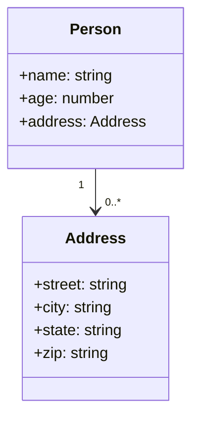

```mermaid
classDiagram
    class Person {
        +name: string
        +age: number
        +address: Address
    }
    class Address {
        +street: string
        +city: string
        +state: string
        +zip: string
    }
    Person "1" --> "0..*" Address
```