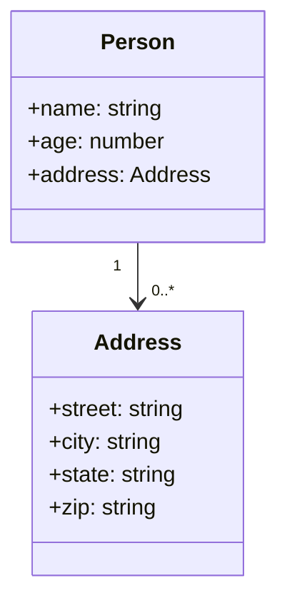
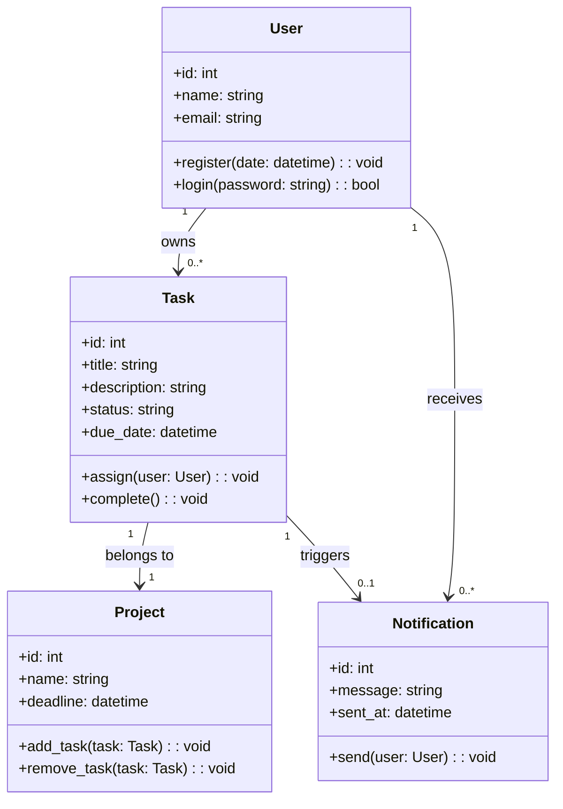
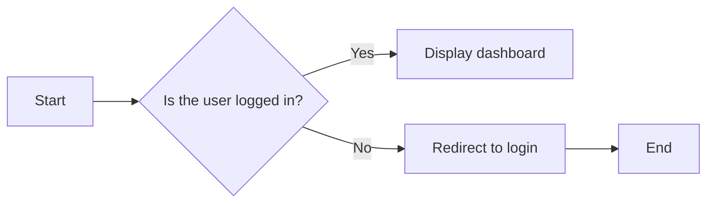
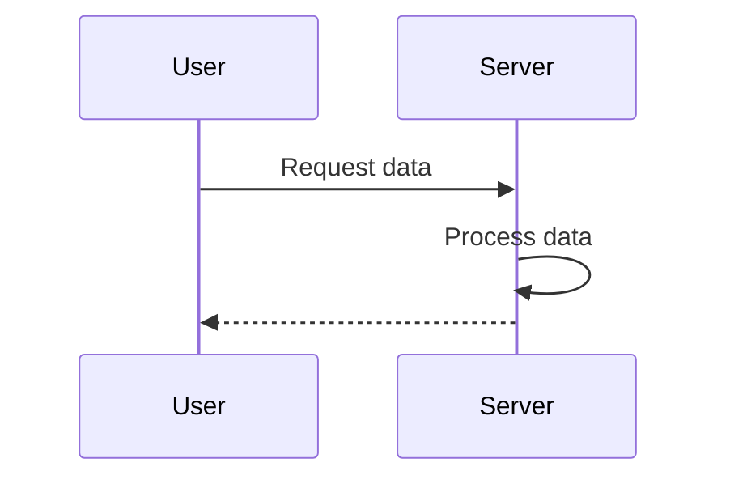
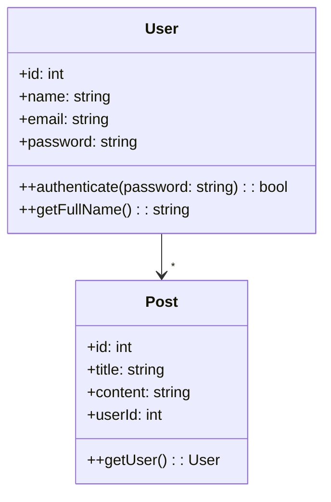
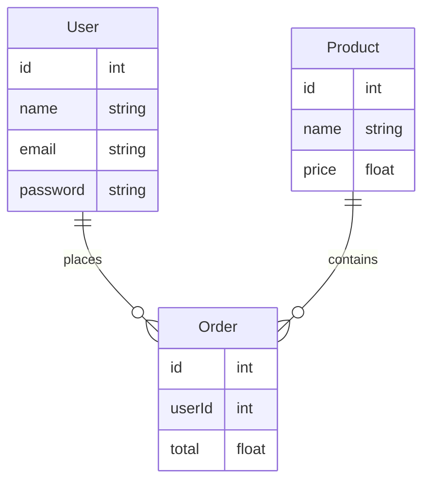
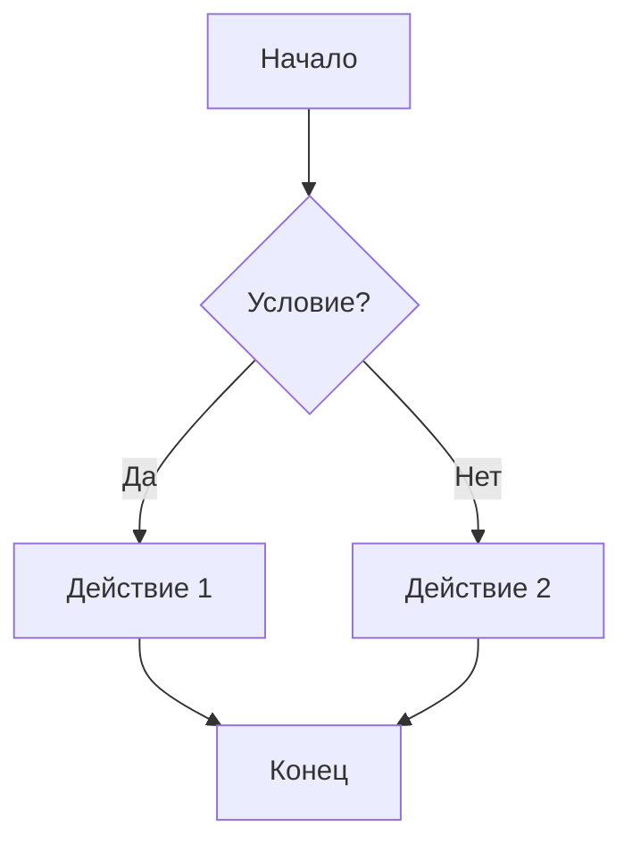
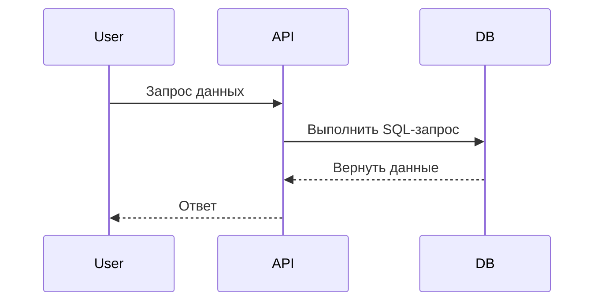
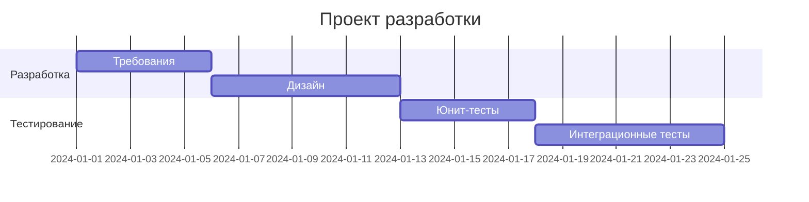
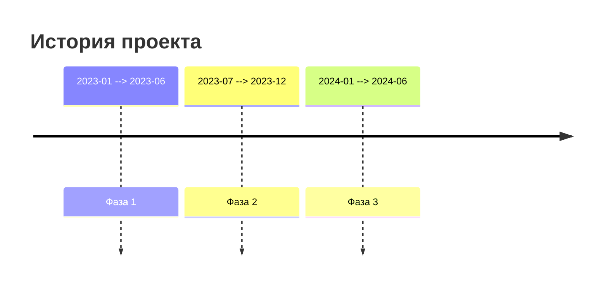

```mermaid
gantt
    dateFormat  YYYY-MM-DD
    title My Gantt Chart
    section Section
    Task 1 :done, des1, 2022-01-01, 2022-01-03
    Task 2 :active, des2, 2022-01-03, 2022-01-05
    Task 3 :pending, des3, after des2, 3d
```












```mermaid
tree
    root [Корень]
    root --> child1 [Дочерний 1]
    root --> child2 [Дочерний 2]
    child1 --> leaf1 [Лист 1]
    child2 --> leaf2 [Лист 2]
```

