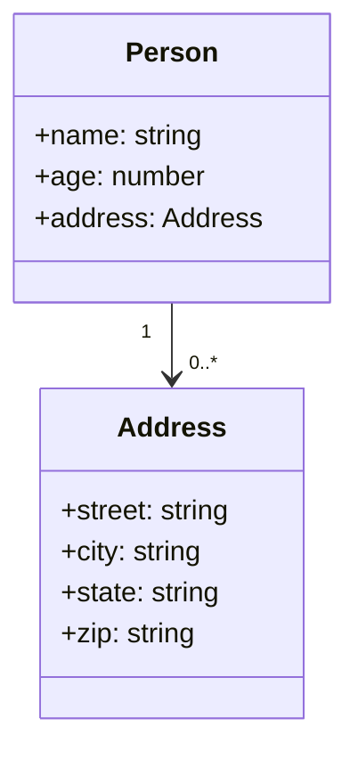
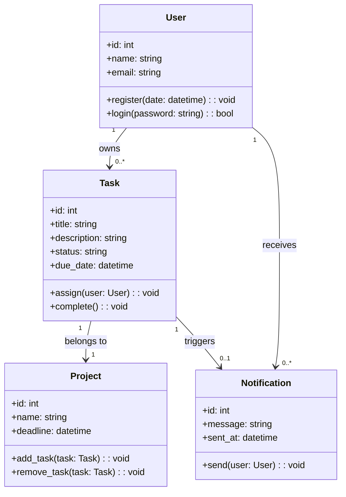

```mermaid
classDiagram
    class Person {
        +name: string
        +age: number
        +address: Address
    }
    class Address {
        +street: string
        +city: string
        +state: string
        +zip: string
    }
    Person "1" --> "0..*" Address
```

```mermaid
classDiagram
    class User {
        +id: int
        +name: string
        +email: string
        +register(date: datetime): void
        +login(password: string): bool
    }

    class Task {
        +id: int
        +title: string
        +description: string
        +status: string
        +due_date: datetime
        +assign(user: User): void
        +complete(): void
    }

    class Project {
        +id: int
        +name: string
        +deadline: datetime
        +add_task(task: Task): void
        +remove_task(task: Task): void
    }

    class Notification {
        +id: int
        +message: string
        +sent_at: datetime
        +send(user: User): void
    }

    User "1" --> "0..*" Task : owns
    Task "1" --> "1" Project : belongs to
    Task "1" --> "0..1" Notification : triggers
    User "1" --> "0..*" Notification : receives
```